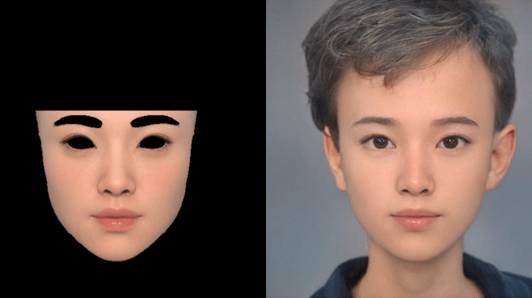

## Unofficial PyTorch implementation of [Rendering with Style](https://studios.disneyresearch.com/2021/11/30/rendering-with-style-combining-traditional-and-neural-approaches-for-high-quality-face-rendering/)

Since [Rendering with Style](https://studios.disneyresearch.com/2021/11/30/rendering-with-style-combining-traditional-and-neural-approaches-for-high-quality-face-rendering/) leverages the StyleGAN2 latent space, this implementation contains StyleGAN2 codes from [the official Pytorch implementation of StyleGAN2-ADA](https://github.com/NVlabs/stylegan2-ada-pytorch).
This work was done in early 2022, and README will be polished soon.

<p align="center">
  
  
</p>

## Setup
Follow the instruction from [the official Pytorch implementation of StyleGAN2-ADA](https://github.com/NVlabs/stylegan2-ada-pytorch) to setup StyleGAN2 and download pretrained model ffhq.pkl.

## Test

```
python train_render.py commandline_args.txt
```


